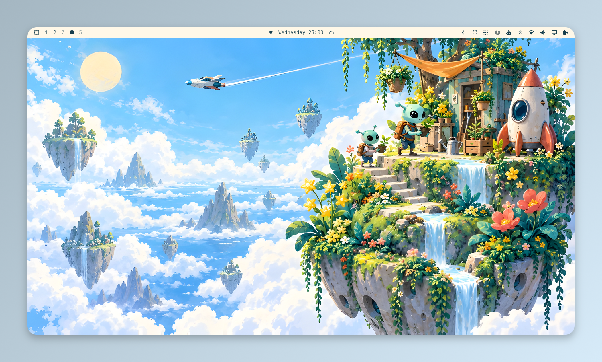
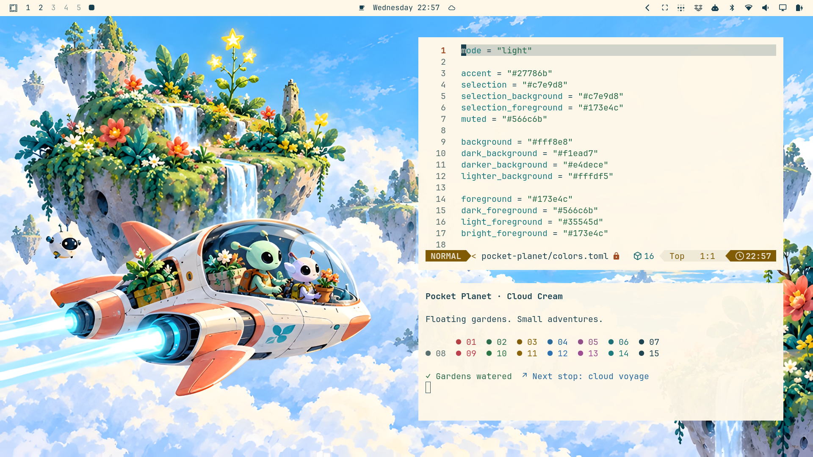
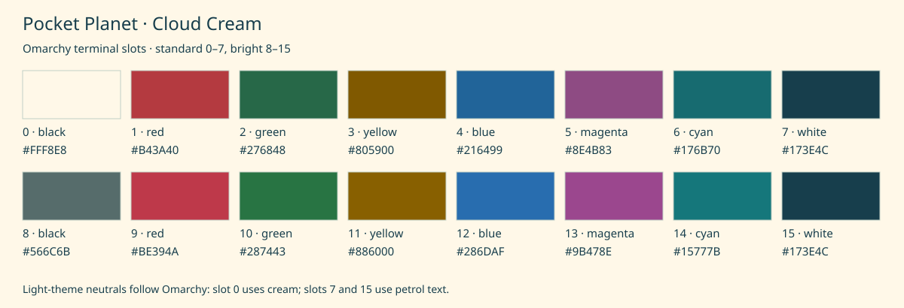
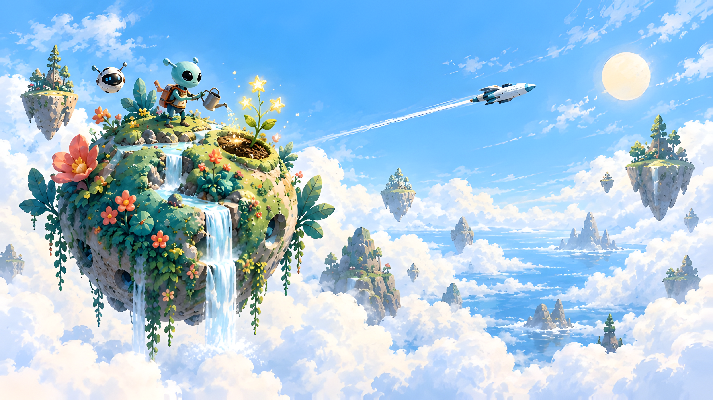
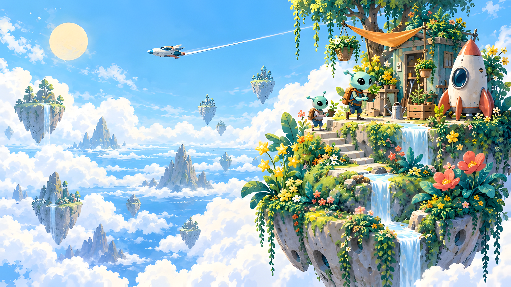
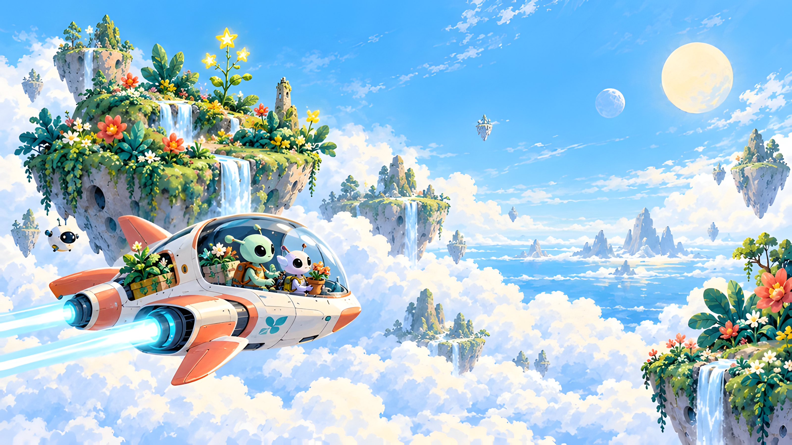
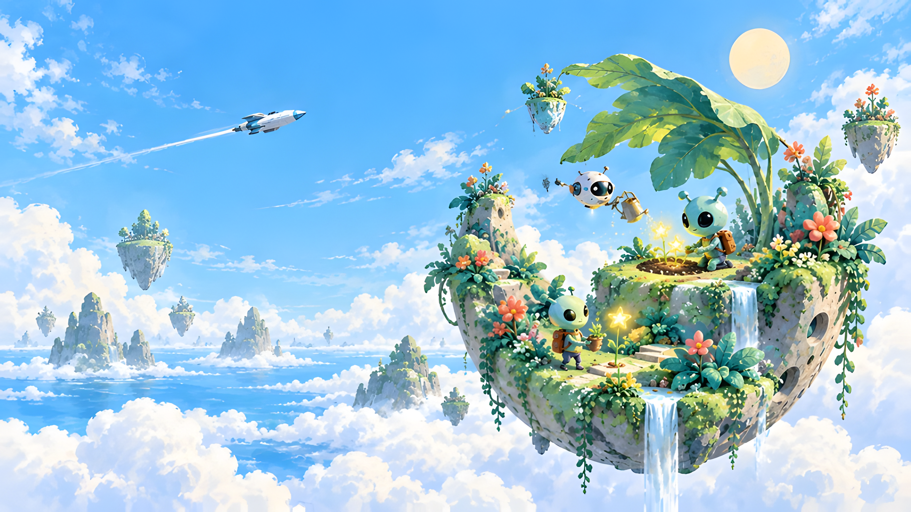

# Pocket Planet Theme for Omarchy

**Four floating gardens. Cream clouds. Mint-green explorers.**

A light Omarchy theme with alien gardeners, star flowers and small spacecraft. The Cloud Cream palette pairs warm cream surfaces with deep petrol text and teal highlights, while coral and sunshine yellow brighten the wallpapers.

<p align="center">
  
</p>

## Install

Install directly from GitHub:

```bash
omarchy theme install https://github.com/jennabrinning/omarchy-pocket-planet-theme
```

Omarchy installs and applies **Pocket Planet**.

To apply it again later:

```bash
omarchy theme set "Pocket Planet"
```

Cycle the four gardens with `omarchy theme bg next`.

Recommended font: JetBrainsMono Nerd Font, included with Omarchy. The theme sets the shell base size to 14 px; terminal font sizes follow personal settings.

## On the desktop

<p align="center">
  
</p>

Cloud Voyage with a Foot terminal colour sample and the theme's colour configuration open in Neovim. Window layout and transparency follow the user's desktop settings.

The bar uses cream surfaces, petrol text and teal active states. Selection uses pale mint with petrol text. Omarchy's existing lock screen follows the same colours over the blurred current wallpaper.

## Terminal colour palette

Every terminal slot in index order: normal colours **0–7**, then bright colours **8–15**. The chart follows Omarchy's terminal templates: slot 0 uses the background, slot 8 uses muted text, and slots 7 and 15 use the foreground. Terminal colours are darker than the decorative wallpaper accents for readability on cream.

<p align="center">
  
</p>

| Desktop role | Colour | Use |
| --- | --- | --- |
| Background | `#FFF8E8` | Terminal, app and bar surfaces |
| Secondary background | `#F1EAD7` | Recessed surfaces |
| Deep background | `#E4DECE` | Deeper surface contrast |
| Light background | `#FFFDF5` | Raised surfaces |
| Foreground | `#173E4C` | Main text and selection text |
| Teal accent | `#27786B` | Focus, active borders and controls |
| Selection | `#C7E9D8` | Text selection background |
| Muted text | `#566C6B` | Comments and secondary text |
| Coral | `#F47C68` | Decorative wallpaper accent |
| Sunshine | `#F5CC62` | Decorative wallpaper accent |
| Mint | `#8DCAB0` | Decorative wallpaper accent |
| Sky | `#98D4EF` | Decorative wallpaper accent |

## Four gardens

All four wallpapers are **3200 × 1800** (16:9), upscaled from the preserved **1672 × 941** generated originals. Click an image to open the full wallpaper; the original is linked beneath it.

<table>
  <tr>
    <td width="50%" align="center"><a href="backgrounds/01-star-garden.png"></a><br><b>Star Garden</b><br>Star flowers, waterfalls and a passing rocket.<br><a href="wallpapers/01-star-garden.png">Generated original</a></td>
    <td width="50%" align="center"><a href="backgrounds/02-seedling-outpost.png"></a><br><b>Seedling Outpost</b><br>A garden stop beneath an open blue sky.<br><a href="wallpapers/02-seedling-outpost.png">Generated original</a></td>
  </tr>
  <tr>
    <td width="50%" align="center"><a href="backgrounds/03-cloud-voyage.png"></a><br><b>Cloud Voyage</b><br>Botanists sailing above a sea of clouds.<br><a href="wallpapers/03-cloud-voyage.png">Generated original</a></td>
    <td width="50%" align="center"><a href="backgrounds/04-moonlet-nursery.png"></a><br><b>Moonlet Nursery</b><br>A crescent garden with tiny star seedlings.<br><a href="wallpapers/04-moonlet-nursery.png">Generated original</a></td>
  </tr>
</table>

Landscape displays work best. Fill mode on ultrawide, 16:10 or portrait displays may crop parts of the gardens. These are not native 4K images.

## Artwork and license

The four wallpapers were generated with OpenAI image generation, then upscaled.

[MIT licensed](LICENSE).

Pocket Planet is a community theme, not affiliated with Omarchy.
